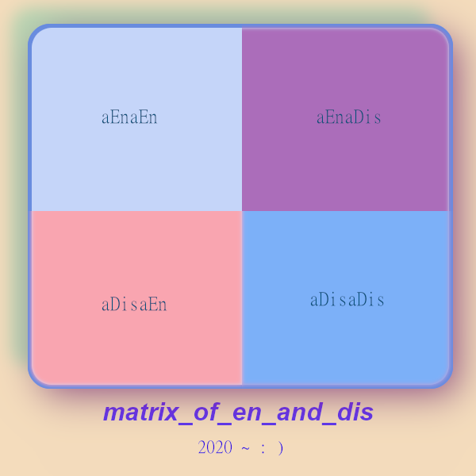

# `~aCOMMONaCONFUZa~`

ALL ACTZ of Actual_Common_Confuzion. 

---

## aCommoConfuza

Taxonomy or Ontology.

> All_Human_Mind exists within a_Common_Confuzion at birth, and again at death.

By articulating common confuzions, Actual_Reality can_be_known.

### Reasonable_Confuzion

> If you are born into a society of actual confuzion, then it is fully reasonable to be confuzed. Reasonable_Confuzion.

> If you hear a new concept, contrary to everything you've ever been told - reasonable_confuzion occurs.

#### aTaboo_of_Confuzion

> Where a Society actz to punish confuzion, a_Taboo_of_confuzion silently_seeds, and deep_concepts_take_root.

Where one of the first ways we are actually confuzed, is when we refuze to admit we are confuzed.

Exactlywhere society forces minds to insist they know, while actually confuzed.

> Such actz of hiding_confuzion are aDeepaFolly.

Because it seeds so many problems later, of Affect/Effect into society. And leads to many deeper concepts of confuzion_about_confuzion. Often to the maximum degree, of a_overwhelm_of_all_human_mind. With one of the deepest of all human tragedies, of wizdom_discarded_in_favor_of_false_glory.

#### aParrotaMentoa or aRobotaMinda

The second was we are confuzed, is when a mind is taught an answer, and simply repeats it.
Without ever actually evaluating the concept_under_words. Where the concept part_wrong we are confuzed.

Observably, is a folly of a_wit_confuzed_by_arrogance - meaning: we can become so proud of ourselves for using a stick as a spear that we can be over_focused on it as the only tool. While missing the concepts of hammer and nail, and skrew and driver - all together!

> This amazing repetition, of going back to what works, over and over - in the face of obvious flaw - is a_part_aFollya.

Observably, is `~aRobotica~` in society - exactlywhere it is encouraged to do the same ACTZ over and over.

`~aSocioaRobotica~` - is actual actz of robotic, scripted, repetition, without deviation - even in a_view_of_clear_flaw.

`~aParrotaMinda~` - is actual actz of repeating what we are told, and gradually being forced to believe it - because those are the only conceptz in mind. Reinforced by a_different_is_wrong_illuzion. That basically rejects any dispute of concepts_etched_deep_into_mind. By equally flawed_excuse. Like, **"dont be so negative", or "look on the brightside"**.

> These are a few, of many reliable indicators, that blurry_concepts_exist_beneath_blurry_words!

#### aPretendaKnowa

- When we forget that we were repeating an answer, we were told, but never check our selves.
- When we overlook that no mind, has actually fully articulated the concept.
- We begin to pretend to know a depth of knowledge, that is never actually there. 
- Especially if society is flawed in actz of: 
- reward_of_fuzzy_answers. And,
- shame_for_curiosity

> It is reasonable for minds in such societies_of_disCuriosity, to aCHOOZEa to aPretendaKnowa.

#### aBroadaBrusha or aBineality. 100_percent_and_absolutely

When we say social~phrases like,  **"I agree 100%" or "absolutely"**, this is a reliable indicator of likely part_flawed concepts_beneath_words. 

Because, in these ACTZ we paint the concepts with a broad brush. Paint_broad_brush. Covering cracks in logic. Gloss_over_detail. These ACTZ are discouraging, because they are a_seed_for_conflict_later. Similarly, the viewz of all-right and all-wrong are often partly_flawed. 

> Partly_Perfect and Partly_Flawed - is a better_reflection_of_actual_reality.

 To look at the world with such VIEWZ, is called a_BINARY_REALITY. With a great shock, for anyone_can_see, of how common it is - once you start to measure it. '~aBlizzardAwaitsUs~` for all_human_mind.

#### DEPTH_of_LOGIC and aLimitaMinda

When the brain cannot hold focus on too many CONCEPTZ, we tend to blank_out in overwhelm. An actual moment of lost_focus, where concepts are too heavy. 

> Exceeds conceptual_gravity, so that the concept cannot_be_seen, with no a_spark_of_AWA_in_mind. 

And certain DEPTH_of_LOGIC can perplex_all_human_minds. 

> Where `~aPerplexea~` is certain, but we shame ourselves into deeper confuzion.

How often do minds wrongly shame themselves or others?

> aWronglyShaming - creates significant barrier to all_human_mind.

 Because we, can and do create actual_barriers_to_CONCEPTS. Social_Barriers_of_actz and Social_barriers_of_CONCEPTS.
 
 > AllHumanzLook, exactlywhere, concepts are rejected and refused from consideration. Is a_Hallmark_ACTZ_of_aFollya.
 
  Either by aTaboo, or a DisRepetition. CONCEPTS are observably blocked from VIEWZ by a significant portion of society. No shame. Is the tree ashamed to only know someone named fibonacci? Doesnt a  aLIMITaMINDa is similar in that there is an actual_limit_of_mind. Sometimes this can be on available information, or exculpatory evidence. But since we can experience overwhelm and blank_out - it is quite possible to humans to arrive at wrong_conclusions simply because they do not have TIME or FOCUS to sort through all the facts and hold all the concepts in the minds eye.

#### Mistake of POSITIVITY and NEGATIVITY

Often we can hear thought leaders in society saying phrases like, "i dont want to be negative", or "look on the bright side". The problem with these statements, while seeking to act wizely by repeating old social norms, are actually deep into folly because a fairly easy to see flaw. Easily forgivable because, it seems to never have been described before.

# THE_MATRIX_of_EN_an_DIS or THE_MATRIX_of_aSparka_and_aDarka.

Instead of putting the emphasis on "positivity and negativity" society would see benefit to emphasize "encouragement" "discouragement" for the following reason. 

Sometimes we actually discourage good.
Sometimes we actually encourage bad.

These ACTZ (when they actually occur) are called aINVERZIONZ.

And they appear to cauze all_human_mind reasonable_confuzion, social_enigma, social_dillema, and affect/effect tragedy of downstream_actz.

The ACTZ we common_confuze_by_inverzion is visualized by a_MATRIX_of_ACTZ:

| <kbd>  </kbd> |
|-|

1) `~aEna~` : Sometimes we actually_encourage_good. "positivity", "hero"       a_Ena (aEnaEn)
2) `~aDisa~`: Sometimes we actually_encourage_bad. "negativity", "villian"     a_Dissa (aEnaDis)

- AllHumanzLook, two a_exact_opposite_inversionz exist.

> aInverzion_of_Good_&_aInverzion_of_Bad

3) `~aDissaEna~` : Sometimes we actually_discourage_good. "bad_negativity"  aInverzaDissaa (aDissaEn)
4) `~aEnaDissa~` : Sometimes we actually_encourage_bad.   "bad_positivity" aInverzaEna (aEnaDissa)

| <kbd>  </kbd> |
|-|

NOTE: we are NOT trying to measure good or bad <yet> just defining it where it actually occures in reality (whether we know it or not). Measurement of actual_good and actual_bad occurs later, in advanced topics, but we do not use the words good and bad, because they are too diluted.

# WE_are_actually_MISSING_WORDS

Where we actually lack WORDS, we also lack ability to reference the CONCEPTS.
So LACK_of_WORDS, largely equates to LIMITED_CONCEPTZ
Societies that have LACK_of_WORDS and LIMITED_CONCEPTZ, would be reasonably confuzed, exactly where the void of words exist.

NOTE: as usual, the exact_opposite_concept also appears true - that EXTRA_WORDZ appears to largely generate EXTRA_CONCEPTZ, but that is also an advanced topic for another section.

# LACK_of_WORDS around aSocioaTaboo

One of the many interesting aspects of SOCIAL~PHRASES is that they tend to map the LIMIT_of_MIND. Here is why. Social_Phrases are often observably silly or fuzzy nature. This appears to be from the lack of evaluation of what we are actually saying. When we gloss_over_details of phrases, we also gloss_over_details of the CONCEPT_beneath_WORDS.

So when society enacts aTaboo on seamonsters... there is a delay set upon the study and better naming of the concepts.
And society can be expected to be confused on those topics until the aTaboo is lifted.

#### LACK_of_WORDZ around CONCEPTS_a_BEYOND_US

Similarly, to confuzion existing around topics we chooze to avoid, there is also confuzion around topics that we have not yet deciphered a reflection to actureality. A stunning example of this, can be observed in a word count of the "positive" and "negative" words, but not in a binary sense. Count all the words that reference ENCOURAGEMENT and all the words that reference DISCOURAGEMENT and you may see a stark epiphany of what a young species all_human_mind truly is.

NOTE: this is an advanced topic for later chapters, but worth a brief description here, to describe confuzion.
The hypothesis goes, that there is a vast majority of aDissa words, but also it appears that there is nearly enemic or mal-nourished number of words for ENCOURAGEMENT and aEna. A massive imbalance appears to exist with an enourmous number of aDissa words compared to aEna words. In addition, a good number of the aEna words that exist appear to have been distorted, or INVERTED (from the confuzion described above). So it appears, there is actual missing words for encouragement, while we exist within an overwhelm of concepts of aDissa. What could account for this? Maybe it is that we arose from a brutal species? And are still young in our awareness? Is this what the minds of 1000yrz from now will see?
That the young human species was tilted linguistically toward distructive actz, rather than enstructive actz? By nature of our coming into education and intelligence gradually and irregularly? This is discussed at length later.

Maybe they will know that with a lack of words, is a lack of concepts, and with a lack of concepts - society would be reasonably_confuzed. Also, the inverzion of reasonable_confuzion exists as actual_extra_awareness. Similar to the actz_of_confuzion is aExactaOpposa, with actz_of_clarity and actual_extra_awareness. A key took for awareness_of_extra_clarity is PRACTICE of `~aPRIZMaWORDZa~`.

> Using SOCIAL~PHRASES, we can peer into all_human_mind, as `~aPRIZMaWORDZa~`.

#### reasonably_confuzed

At last review, Humanity is a reasonably_young_intelligence.

> All_human_mind is a young_intelligence. Having only awakened a few hours ago, all_human_mind is still observably drowsy. Where you can count_the_fuzzy_concepts with SOCIAL_PHRASES. 

And look for actual_concept_flaws. Where the surprise may be, that the expectation of only a few flaws - quickly turns to  actual viewz - that we_swim_an_ocean_of_conceptual_flawz. 

> A blizzard_of_concepts awaits all_human_mind.

As a direct cauze_of_acting, actually confuzed_about_confuzion.

> All_Humanz_Look, a baby is reasonably_confuzed, the same as a dying person is reasonably_confuzed.

#### unnecessary SHAME_of_reasonable_confuzion

There is a frequent shame, observable for minds that did not know, or forgot, or saw a distortion of reality. The actual_conceptual_flaw here is:

> Actual_Reality is vastly_larger than our VIEWZ of it. So SHAME of not_seeing_everything is always_a_folly, because this is the default reality, all_human_mind exists in - for all_human_time.

- AllHumanzLook, there is no point, at which any human - knows everything.

And this has to be true, for simple reasons - like not being able to look in your own ear to your brain.

Or never knowing what is happening - at this very moment - on the exact_opposite point of earth.

> There is alwayz, a_vast_blindspot for all_human_mind, indicating that shame_of_a_non_aKnowa is aFollya.

`~aFollya~` actual actz of folly. `~aMaxaConfuza~`.

#### aWronga & aWrronga & aMaxaConfuza

> All_human_mind_actz_in_aWronga, far more often, than it can ever admit.

Frequently_wrong. Wrong_in_multiple_viewz. Clear_on_some_aWronga_on_others.

Actually_really_wrong. Not just wrong, but offensively extra_wrong. 

NOTE: not pointing at where this exists. But simply saying actual_deep_wrongness hypothetically exists sometimes.

> Is any mind equipped, to point exactly, at Deeply Discouraging concepts forced on others?

`~aExtraWrronga~` - is the mind who commits increasing actz of discouragement, based on a_wrong_concept - that dives a continues unnecessary abuse of others in Affect/Effect and Physical/Emotional/Mental.

#### Flaw of HERO_VILLIAN, ANGEL_DEMON, positive_negative.

The fairly obvious flaw is that it projects a static reality onto a dynamic reality.

Gloss_over_details in broad_brush, binary_reality.

Not accounting for innerstate, or exculpatory facts. Not accounting for ability to change.

Is actually a discouragement on doing the right thing after labeling someone bad (permanently).

Labeling a person... evil... may never be totally fair. For the following reasons.

1) The person labeling "evil" wrongly, may be more "evil" than the person labeled "evil"

2) The villian is totally bad, but what if they do it so that they can go home - and be a great dad?

Are they really evil? Is the person labeling them the villian the true villian?

3) The hero is seen as totally good, until they go home in their super ego - and are a totally negligent father.

Are they really a hero to the children they ignore?

If we gloss over such viewz, we are making these common confuzionz, as a BINARY_REALITY.

But if we capture these viewz, when they reflect actual_reality, then we_can_see with more clarity. 

a_clearer_reality. `~aClarieality~` Actual_Clarity_Reality

#### smart_&_dumb ACTZ

smart_&_dumb are also clearly flawed concepts for the same reasons of gloss_over_facts.

The common_confuzion appears to be: Smartness or dumbness is a measure of ACTZ not of PERSONA.

> Reveal the concept flaw: that a "smart person" can do a dumb_act at any moment, and that the exact_opposite appears true simultaneously, that a "dumb person" could act with a spark of genius at any moment.

> There is no such thing as a smart or dumb person - only smart or dumb ACTZ.

#### TRUE_for_you_not_for_all

Far too often, arguments are made from the point of personal VIEWZ. Like "it is hot in here", "no it is cold in here" - depends on where you sit! Because one seat may be in front of the cool air, while the other is in the sun. So many times the FLAW_of_CONTEXT is clearly overlooked, and useless arguments fill the air - where wizdom could have existed - but was expunged by confuzion.

One of the most common examples of true_for_you_not_for_all is on `~aToxicaSocioa~`. Where one person may clearly experience a toxic situation in society, the other person who cauzes the toxicity - will insist from their VIEWZ that it is not toxic at all. Convieniently leaving out the affect/effect of their own ACTZ as a cauze of discouragement for others.

#### confuzion_about_confuzion

Society is observably confuzed, about the degree to which all_human_mind is actually_confuzed. 

> Look_how, we cannot even point to confuzionz, because at every corner of reason, is someone already there pointing directly back at you.

This is the `~Social_Cacophany~` that all_human_mind is born into, and must endure.

> All_Human_Mind shares the common concept, of looking up, and never_see_beyond_a_darkness.

#### a_life_of_confuzion

Count, how many human minds of all_human_time, lived life_long_confuzion?

> The vast majority of all_human_mind, appears to exist in life_long_confuzion.

#### `~aStructaBrokaSocioa~`

actual structure is broken in society. Things that would help people are not done.

Fundamental wrongness of concept, beyond all_human_mind, and we have many aStructaBrokea

`~aNonaFuncta~` `~aSelfaFuncta~` `~aNonaSocioaFuncta~`

`~aDissaSocioaFuncta~` - actual discouraging social actz of affect/effect function.

- example: `~aEnaStructa~` and `~aDissaStructa~`

#### wrong_measure_of_confuzion. wrong_measure_of_wizdom

Observably, we can reasonably_confuzed, to see someone elses success at concepts - that are actually flawed.

Because then we mis-attribute wizdom to someone who is rich and successful. But often, this is not wize concepts underneath words, but the result of an acually flawed social system. How many minds would be able to decipher such an actual_reality? Not many. So we can see a fish swims upstream because it is compelled to, not because it is wize.

Humanity has a vast array of compusions to act. Where actz are not driven by wizdom, but by anything else.

- We can measure wizdom by the correct repetition of words.

- We can measure wizdom by the size of a bank account.

- We can measure wizdom by success.

But all of these MEASURES, conceal rather obvious flaws. 

> a_better_measure of wizdom or confuzion - is actual_clarity_of_mind.

> Just because an athelete is an amazing athlete, does not make them a good parent or teacher.

> Just because a person is wealthy with resources, does not make them wealthy in mind.

So with great irony, exactlywhere we_measure_wizdom_wrong, we_measure_confuzion_wrong too.

> Wherever the measure_of_confuzion is inverted, to be the measure_of_wizdom - that is actual_illuzion.

The BEST_MEASURE_OF_CONFUZION - is a_low_gravity_number_of_words, with blurry_concepts_beneath_words.

The BEST_MEASURE_OF_CLARTIY - is a_high_gravity_number_of_words, that reflect_actual_reality_well. With  clear_concepts_beneath_words.

## anti-hero
thoughtless, heartless, senseless, emotionless. 

> All of these are discouraging - that is the measure.

> silence is discouraging
> heartlessness is discouraging
> senselessness is discouraging
> emotionlessness is discouraging
> thoughtlessness is discouraging
> voicelessness is discouraging

> actual_confuzed_society or actual_illuzion_society is discouraging

> force to accept actual_confuzion or actual_illuzion as aFacta is discouraging for actual_reality.

> illuzion_as_aFacta only seeds inevetable discouragement to the young mind who sees actual_reality and choozes to see actual_reality.

> to actual_illusion, silence, is not only discouragement - but also observable, repetititive a_self_tragedy.

If confuzion is rising, and illuzion is increasing, how can this be measured?
What is correct response actz to actual_increase_confuzion?
> No human mind is immune to confuzion. All_human_mind can exist in actz_of_confuzion at any moment, and this is not the problem, because we reflect on confuzion to learn actual_reality, the problem is when we are unable to reflect on actual_reality, and actual_insist_wrongness_is_rightness, which is cauze of diluted_factz for all_human_mind.

#### all_difference_is_wrong & a_retaliate_not_learn

When anyone reacts to a difference to see it as wrong, before evaluation, articulation - is discouraging ACTZ for everyone. And when anyone reacts to a difference by retaliation not listening and learning - is discouraging ACTZ for everyone. aRootCauze_of_poly_confuza for society.

#### discouragement_by_aPolyConfuza

> Many confuzions threaded together is like a chain binding up concepts of the mind. 

Rendering, ability to think... non_moveable. Where deep tragedy of existence, 
is aNonaVizibla, in addition to a_life_long_affliction.

> The only way out, of `~aNonViziblaConfuza~` is to name_it_well, aBettaWordza.

This concept (of non_visible_confuzion) is quickly dismissed in current_society, as falsly_non_important - which is the exact mistake we make - to not_clear_up_confuzionz.

> Never_blindly_believe_in_anything, becauze it alwayz_changez, and afalseBelief, keepz_a_mind_stuck_in_view.

> All_CONZEPZ must be named_well, else they never_be_known. Simple as that.

`~aStuckaMinda~` - not this because too_offensive, do_not_focus_on_mind_as_root_cauze_but_viewz 

`~aDissaVIEWZa~`

`~aStuckaVIEWZa~`

`~aGunkaVIEWZa~`

`~aBunkaVIEWZa~`

aBunka, aGunka, aFoggya, aSmoggya, aGroggya, aBlurrya, aBlearya.

`~aFuzzyaVIEWZa~`

`~aFoggyaVIEWZa~`

`~aEnsteadTry~`:

`~aPolyaVIEWZa~`

`~aExtraVIEWZa~`

`~aEnaVIEWZa~`

## aGRANDaPARADOXa

Unbelievable thing, about wordz that self_describe, is that as soon as you `~aCanSee~` the word, the CONCEPTZ pass_into_mind_as_aSparka.

That point alone is a SIGNIFICANT_ENHANCEMENT_of_ENGLISH. But there are many more...

> Where aGRANDaPARADOXa, appears exactly everywhere.

Just as, the sun_and_photonz_out, is aExactaOpposa, of blackhole_and_photonz_in... so too - INVERZIONZ appear at every level, all the way down to chemistry, electricity, biology, and to great_surprise such a_duality_exists in All_Human_ACTZ. 

> Exactlywhere, actz_of_kindness_&_aWizdoa or actz_of_blind_rage, between_is_an_inverzion to exact_opposite.

`~aInverza~` - actual act of exact_opposite inversion... of anything_&_everything, or all_existenze

AllHumanzLook, at the cauze of argumentz, disputez, eruptionz, interruptionz,  distortionz, disceptionz, confuzionz, illuzionz, bitterness - anyoneCanSee, is all_inverzionz. Wthere two_opposite_conceptz_collide. And a_stupify_all_humanity_all_time or all_time_up_until_now. Until our aFollya is put into EXACT_WORDZ. aBetterWORDZ.

> ExactlyBecauze, actz to disagree, condemn, dissmiss, deflect, distort, and fight - we_never_learn!

AllHumanzLook, how the cauze of all_dispute appears to be a_deep_confuzion.

AllHumanzLook, how the ultimate failure of all_human_mind, is to make a_clear_mistake, from a_clear_awronga, then to become FALSLY_ASHAMED, FALSLY_BLAMED, and so FORCED_to_TABOO, DENY_a_SPARKA, REJECTED_CONZEPTZ, actual_loss_of_wizdom, without ever knowing it, with a_focus_firm_on_confuzion, and a_focus_firm_on_illuzion.

> ExactlyWhere, the a_focus_on_aEn never actually occured, was actually_never_seen, aNeveraSparka.

aInterrupta, aDisrupta, aErupta, aInverza, aDistorta.

aPolyConfuza, can be non_vizible, systemic and total. ByNature a process of `~aDissiveness~`, has a curious way of a_spiral_down, to a_deep_illuzion. 

> ExactlyBecauze, all_effort_to_distort_actual_reality.

#### confuza_by_awronga
#### confuza_by_arepetoa
#### confuza_by_afalza
#### confuza_by_apretendaknowa

#### confuza_by_afalza_equivalence

#### confuza_same_wrong_from_both_arguments

Sometimes we can have 2 people arguing different words, but with the same confuzion conceptz_under_wordz. It is astonishing to see. But the discouraging ACTZ of dismissiveness and silence or distortion are examples of this. It is these discouraging ACTZ: where the bully bullies, and then the bullied bullies the bully. Clearly, we need better articulation for such ACTZ.

#### confuza_defence_of_overthinking

The problem with this confuzion is clear:

> the consequences of overthinking are generally less dangerous than underthinking.

1) The consequences of overthinking include stress and loss of time. 

Maybe the stress and time is not because thinking is bad, but because the thinking_is_actually_mistaken.

And there EXISTS an actual_better_way, but we just have not_yet_spark_the_concept_into_mind.

Which causes all kinds of confuzion_in_society as some minds stick_to_repetition, and some minds try to point_out_actual_flaw, where some minds act in actual_unfair_rejection, actual_unfair_retaliation, and actual_unfair_dismissal. 

> The consequences of underthinking_human_mind are historically much more tragic than overthinking_human_mind.

2) Overall, if aHumanzLook at all_confuzion, all_illuzion, all_suppression, and all_disequity, anyone_can_see a common theme of underthinking, behind_a_veil_of_taboo, to justify_actual_unfair_actz. Whereas, the exact opposite is exact_opposite affect_&_effect. aHumanzLook how overthinking, in general, does not appear to play much role in all_confuzion, all_suppression, all_suffering. 

> Overthinking appears to be a reasonable response to Underthinking.

More than by_Nature, overthinking appears to be a forced response, of having to answer for actual_damage_of_underthinking. Which obscures a fascinating insight beyond aDoublaConfuza, of aDoublaNonaReflecta.

- double_confuzion is where a) what is wrong here b) how do I stop the discouragement, and turn to aEn.

- double_non_reflection (is super interesting) in that the person who ACTZ in DISCOURAGMENT - does so because they think they are helping, but if it is not accepted - it didn't help. 

a) the first non evaluation, is the message not being tailored correctly to the receiver.

b) the second evaluation, may be that the message itself is wrong.

So what anyone_can_see, 

a) we do not evaluate the best way to say things 

b) often because we did not evaluate the concept_beneath_words to begin with.s

Most of us are making the mistake of faithfully_repeating_bad_advice_without_ever_reflection

#### `~aNevera~`

- actual actz that never occur.

`~aNeveraSparka~` and `~aNeveraReflecta~`

> If a mind never actually reflects on conceptz_beneath_wordz, then that mind is also actually_blocked, from seeing beyond those words! The mind can become stuck in actual_mental_repetition. 

To `~aDispella~` `~aLoopaMinda~` :

1) See the many CONCEPTZ in mind, that are `~aWronga~`,
2) Remember it is by_Nature to be `~aWronga~`.
3) Then `~aInverzeaWronga~`, or `~aReverzaWronga~` and
4) EVALUATE_REFLECTION_of_ACTUAL_REALITY
5) If your VIEWZ aDissaReflecta, repeat steps.
6) If your VIEWZ aEnaReflecta actual_reality -> LEARN.
7) And joyfully share everything you learn.

`~aDispella_ToxicaMinda~`

#### `~aDissaDevolvya~` & `~aDissaDistortya~` & `~aDissaSuppressUs~`

Some minds are born into actual_confuzed_society. Of those minds, obervably rare is the actual_spark_of_awareness of the actual_wrongz_of_society. Even rarer, is the successful actz_of_refuting_actual_wrongz_of_society. 

> all_human_minds, experience reasonable_confuzion of the social_mind, that we are randomly born_into.

If you EXIST, in society of consistent_social_encouragement, reasonable_confuzion would exist in viewz, as to the fact that consistent_social_discouragement EXISTS at all. Then it would take OBSERVATION and ARTICULATION to see the myriad of ACTZ that AFFECT/EFFECT other minds (not ours). Observably, current_human_mind is easily tripped up on this common_confuzion. 

> Anyone_Can_See, aTRAGICa where it actually_exists, but also many aChooze_to_Not_See, and some aChooze_to_retaliate, in successive degrees_of_confuzion and escalated degrees_of_illuzion.

Where this happens, actual_tragic_actz exist, and enevitably wait for all_human_articulation of the non_visible_actual_reality.

Additional measures of actual_social_mind is, exactlywhere:

- we_actually_discourage_actz
- we_actually_discourage_otherz
- we_actually_distort_actz
- we_actually_reject_factz
- we_actually_deny_reality
- we_actually_chooze_illuzion
- we_actually_discourage_wizdom
- we_actually_suppress_otherz
> but also, we_actually_evolve_otherz too!
- we_actually_encourage_actz
- we_actually_encourage_otherz
> but if we measure_actz_of_aEnanDiss, anyone_can_see, 

all_time, massive_historical_viewz_of_carnal_reality

for all_human_mind, where

we_evolve_beyond_carnal_reality

But also stuck_focused in the mind_of_our_timez.

> So many other viewz to focus on, measure how often we chooze_one_focus.

See_BOTH_viewz, Principle_of_BOTH.

NOTE: `~aPRIZMaWORDZa~` is NON_SPECIFIC_INFERENCE, NOT saying exactlywhere this EXISTS - but a simple reference to where it a_may_exista. Where, sometime in someplace - the conzeptz_reflect_actual_reality. Where all_human_mind is aware of it and NOT. That is `~aPRIZMaWORDZa~`.

#### common_confuzion_doctors_confuzed_too

  A very important confuzion that is very challenging - is actual_confuzion_by_authority.
  It is non_intentional, actual_honest_error, of spectacular_consequence in AFFECT_&_EFFECT.
  Despite obvious factz to the opposite, we_cannot_see. 
  We can actually_over_trust in actual_confuzed_authority, quite easily - because we_want_to_believe.

  > NATURALLY, its starts as a guess. 
  
  And of course we_guess_wrong_the_first_time. 
  And we_self_shame_when_we_shouldnt
  And we begin to become over_confident_in_repetition and over_confident_by_echo.
  And over_confident_by_avoidance, and distance
  and over_confident_by_silence.
  And over_confident_by_authority_disresponsibility. 
  And under_confident_by_shame_when_we_shouldnt.
  And under_confident_by_taboo.
  And under_confident_by_mind_blindness. 

> by_nature, at_first_all_human_mind_cannot_see, then for some, we_can_see.

> But then by_nature again, we_can_see what_society_cannot_see, but stuck, trapped helpless_to_speak_sense_to_senselessness, because we actually_do_not_have_the_words_yet.

#### actual_social_confuzion and actual_social_illuzion

> It starts with a guess, that is validated, but never evaluated - just iterated - until it 

breaks_against_actual_reality.

NATURALLY, our society favors confidence, and results, and social-support.

If you have those things, actually_wrong_conceptz can be brought_with_authority - and deeply_adopted_by_society.

Exactlywhere, society exists in actual_wrongness, there is active ongoing consequence - of actual_double_confuzion

Here is `~aDoublaWronga~`

1) society has actual_wrong_concepts. `~aSocioaWronga~`

2) most people `~aCannotSee~` aFlawz - often becauze_of_actual_NON_EVALUATION

   - in `~aNeverEvaluates~`, `~aSocioa~` can go robotic, automatic, polluted - and exactOpposite.

   - `~aDissaCurioa~`, `~aDissaQuerioa~`, `~aDissaMentoa~`

- What of the minds who chooze_to_see_actual_reality, in a society that actively_distorts_reality?

- Are some of us discouraged_by_confuzion, or discouraged_by_illuzion?

- Do we have a right to not be discouraged_by_illuzion?

Especially with new technology.

> How do we answer confuzion?

## KEY MEASUREMENTS of CONFUZION.

a) depth_of_CONFUZION.

b) depth_we_say_things_we_do_not_understand.

c) depth_we_do_not_see_CONCEPTZ_under_WORDZ.

> sometimes actual_reality is shocking to see. 

d) depth_we_avoid_to_seek_what_we_do_not_want_to_see.

e) depth_add_words_add_CONCEPTS, or exact opposite.

 - Many more advanced breakthroughs follow after, like snowflakes in a blizzard.

f) depth_of_REFLECTION: that CONCEPTZ reflect ACTUAL_REALITY.

g) depth_of_aPretendaKnowa

h) depth_of_illusion

i) depth_of_CONFUZION_by_aINVERZIONZ

j) depth_of_CONFUZION_by_aOMISSIONZ

k) depth_of_CONFUZION_by_aDISCEPTIONZ
k) depth_of_CONFUZION_by_aPRETENDaKNOWa
k) depth_of_CONFUZION_by_ILLUZIONZ
k) depth_of_CONFUZION_by_aDisReflectaz

